# Multi-Tenant AI Platform

> A production-grade RAG (Retrieval-Augmented Generation) platform built as the
> capstone assignment for an Advanced AI/ML Engineering course. Multiple isolated
> users can upload PDF and CSV documents, then query them through a natural
> language interface powered by a smart routing agent and a configurable LLM backend.

[](https://www.python.org/downloads/)
[](https://fastapi.tiangolo.com)
[](https://www.trychroma.com)
[](https://redis.io)
[](LICENSE)

---

## Table of Contents

1. [Assignment Objective](#1-assignment-objective)
2. [Problem Statement](#2-problem-statement)
3. [Solution Architecture](#3-solution-architecture)
4. [Key Features](#4-key-features)
5. [System Architecture](#5-system-architecture)
6. [RAG Pipeline Workflow](#6-rag-pipeline-workflow)
7. [Multi-Tenant Design](#7-multi-tenant-design)
8. [AI Agent Routing Logic](#8-ai-agent-routing-logic)
9. [Technology Stack](#9-technology-stack)
10. [Project Structure](#10-project-structure)
11. [Installation — Local Setup](#11-installation--local-setup)
12. [Docker Setup](#12-docker-setup)
13. [Environment Variables](#13-environment-variables)
14. [API Endpoints](#14-api-endpoints)
15. [Example Use Cases](#15-example-use-cases)
16. [Testing and Validation](#16-testing-and-validation)
17. [Screenshots](#17-screenshots)
18. [Results Achieved](#18-results-achieved)
19. [Limitations](#19-limitations)
20. [Future Enhancements](#20-future-enhancements)
21. [Author](#21-author)

---

## 1. Assignment Objective

**Course:** Advanced AI/ML Engineering  
**Task:** Build a Production-Ready Multi-Tenant AI Platform (RAG + Agent + API + Scaling)

The assignment required building a complete end-to-end system that demonstrates mastery of:

- Retrieval-Augmented Generation (RAG) pipelines
- Multi-tenant data isolation at the architecture level
- AI agent decision-making (retrieval vs. direct LLM response)
- Production API design with FastAPI
- Caching, logging, monitoring, and Docker-based deployment
- Bonus: multi-LLM support and cost/token tracking

---

## 2. Problem Statement

Large Language Models have a fundamental limitation: they can only answer from
their training data. Users cannot ask an LLM about a private document it has never
seen. The naive workaround — pasting the entire document into a prompt — breaks
down for anything larger than a few pages and leaks one user's data to another.

This platform solves three problems simultaneously:

1. **Knowledge gap** — Users can upload their own documents and query them with
   natural language, receiving answers grounded in their actual files rather than
   general LLM knowledge.

2. **Tenant isolation** — In a shared system, user A must never see user B's
   documents or query results. Isolation must be enforced at the data layer,
   not just the UI layer.

3. **Intelligent routing** — Not every question requires a vector database lookup.
   A rule-based routing agent avoids unnecessary retrieval for general-knowledge
   questions, reducing latency and cost.

---

## 3. Solution Architecture

The solution is a three-service Docker stack (FastAPI app, ChromaDB, Redis) with
a layered RAG pipeline inside the application:

```
User Request
    ↓
FastAPI (middleware: tenant validation, logging, error handling)
    ↓
CachedQueryService  ←→  Redis (cache)
    ↓
RoutedQueryService
    ↓
RouterAgent (5-rule deterministic decision)
    ↓ RETRIEVE                    ↓ DIRECT
QueryService                 LLMProvider.generate()
    ↓
embed → search → assemble → LLM → response
```

Every component is wired through FastAPI dependency injection. No service
creates its own dependencies — all infrastructure objects (ChromaDB client,
Redis pool, embedding model) are singletons initialised once at startup.

---

## 4. Key Features

| Feature | Status | Notes |
|---------|--------|-------|
| Multi-tenant user isolation | ✅ Implemented | Six enforced layers |
| PDF document ingestion | ✅ Implemented | pdfplumber parser |
| CSV document ingestion | ✅ Implemented | pandas parser |
| Text chunking with overlap | ✅ Implemented | LangChain RecursiveCharacterTextSplitter |
| Vector embeddings | ✅ Implemented | sentence-transformers all-MiniLM-L6-v2 |
| ChromaDB vector storage | ✅ Implemented | Cosine distance, persistent |
| Semantic similarity search | ✅ Implemented | Tenant-scoped per query |
| Context assembly + budget | ✅ Implemented | 2000-token budget, threshold filtering |
| AI Router Agent | ✅ Implemented | 5 deterministic rules, <20ms overhead |
| RAG query pipeline | ✅ Implemented | embed → retrieve → assemble → prompt → LLM |
| OpenAI LLM integration | ✅ Implemented | gpt-4o and compatible models |
| Ollama local LLM support | ✅ Implemented | Any model pulled via `ollama pull` |
| Redis query caching | ✅ Implemented | Per-user TTL, auto-invalidation on upload |
| Token usage tracking | ✅ Implemented | prompt + completion + total per response |
| Structured JSON logging | ✅ Implemented | request_id, user_id, latency on every log |
| FastAPI REST API | ✅ Implemented | /upload-doc, /query, /user, /logs, /health |
| Docker Compose deployment | ✅ Implemented | Three-service stack with health checks |
| Input validation | ✅ Implemented | Pydantic v2 schemas throughout |
| Domain exception hierarchy | ✅ Implemented | Maps cleanly to HTTP status codes |
| Anthropic LLM integration | ⚠️ Partial | Code present, package not in requirements |
| Async document ingestion | ❌ Not implemented | Upload is synchronous |
| Metrics persistence (GET /logs) | ❌ Stub only | Returns placeholder zeros |
| Exact token counting (tiktoken) | ❌ Not implemented | Character approximation used |

---

## 5. System Architecture

### High-Level Architecture Diagram

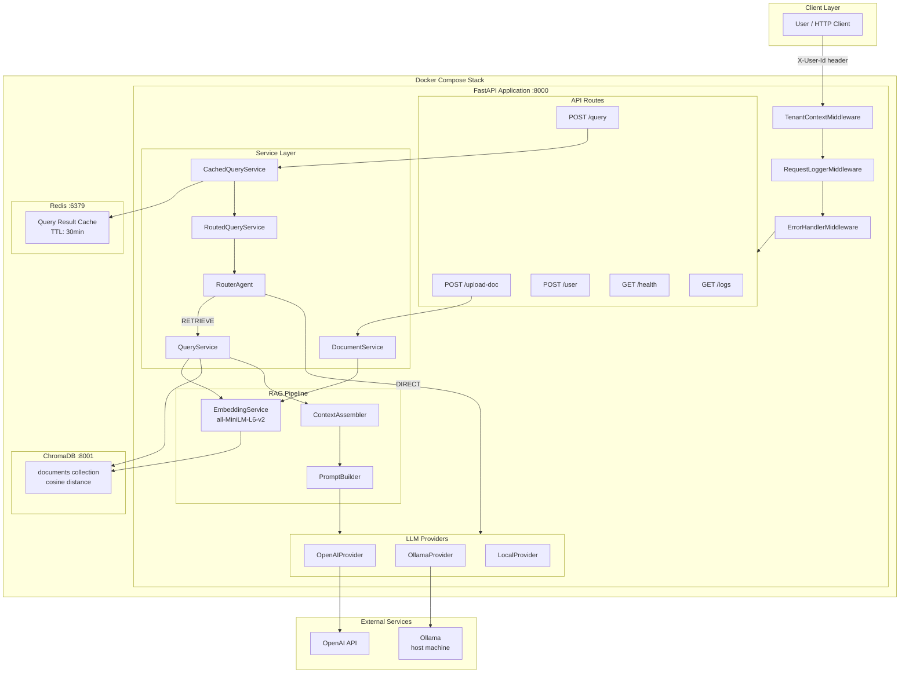

### Deployment Diagram

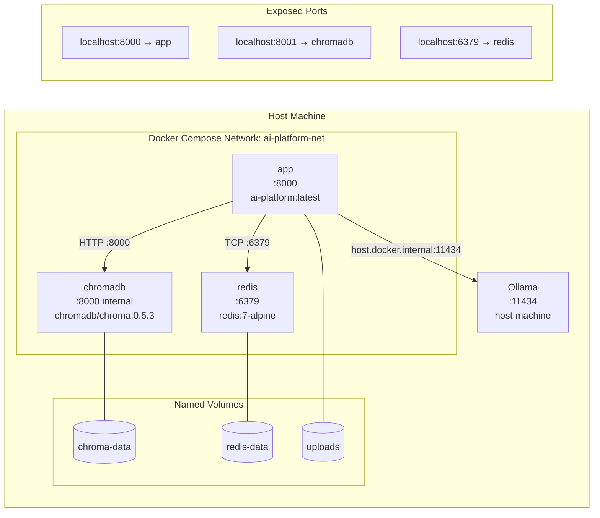

---

## 6. RAG Pipeline Workflow

### Document Ingestion Flow

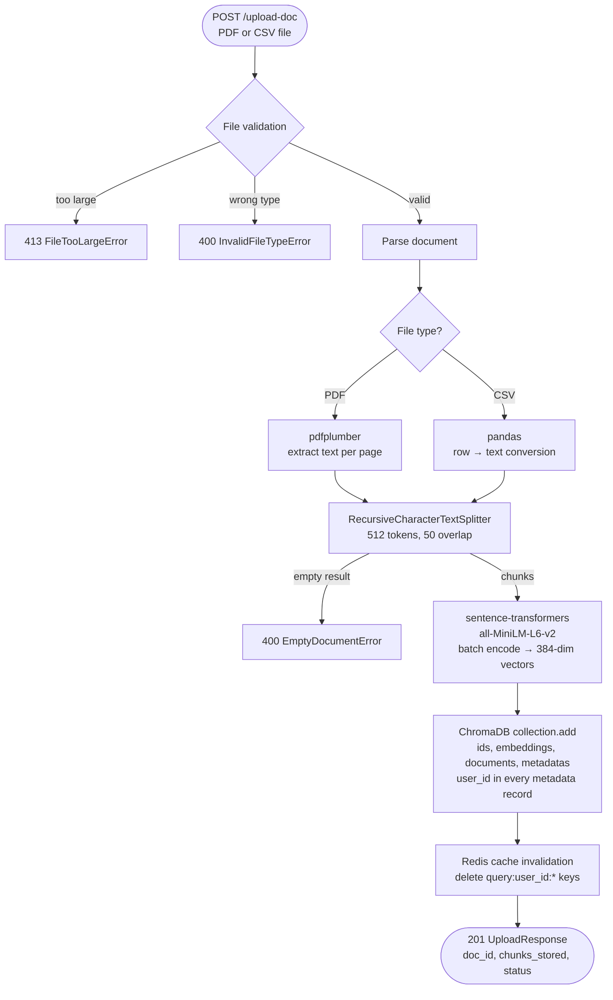

### Query Processing Flow

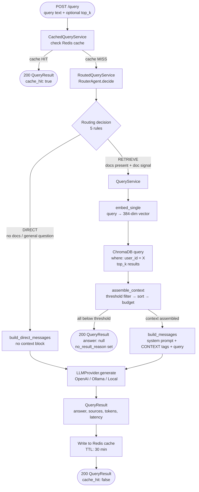

### Request Flow Diagram

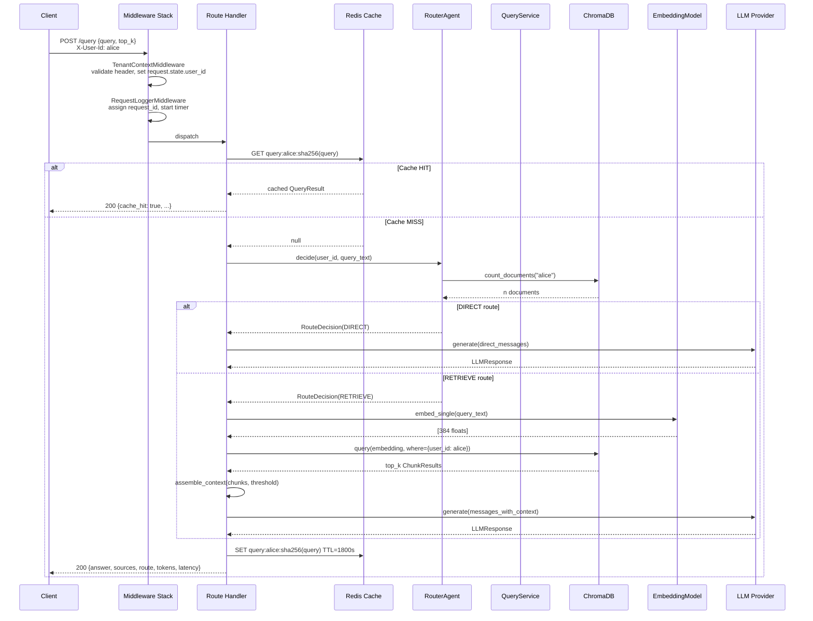

---

## 7. Multi-Tenant Design

The platform enforces user isolation through six independent layers. Bypassing
one layer cannot compromise data — every layer independently enforces the boundary.

| Layer | Mechanism | Where Enforced |
|-------|-----------|---------------|
| **1. Header validation** | Every request must include `X-User-Id`; missing or empty header → 401 | `TenantContextMiddleware` |
| **2. Dependency injection** | `user_id` extracted from `request.state` via `Depends(get_current_user_id)` | `dependencies.py` |
| **3. Vector store filtering** | Every ChromaDB query includes `where={"user_id": {"$eq": user_id}}` | `ChromaRepository.search_chunks()` |
| **4. Write-time metadata** | Every stored chunk carries `user_id` in its metadata | `ChromaRepository.add_chunks()` |
| **5. Cache key namespacing** | Cache keys are `query:{user_id}:{sha256(query)}` — no cross-user collisions | `CacheService` |
| **6. Cache invalidation scope** | Upload invalidates only `query:{user_id}:*` — other users' caches untouched | `DocumentService` |

**Structural enforcement:** Every `ChromaRepository` method requires `user_id` as
a mandatory positional argument with no default value. It is architecturally
impossible to call any repository method without supplying a user ID — Python
raises `TypeError` at the call site if it is omitted.

---

## 8. AI Agent Routing Logic

The `RouterAgent` implements a deterministic five-rule decision tree. No LLM call
is made during routing — the entire decision takes under 20ms (one ChromaDB count
query + string matching).

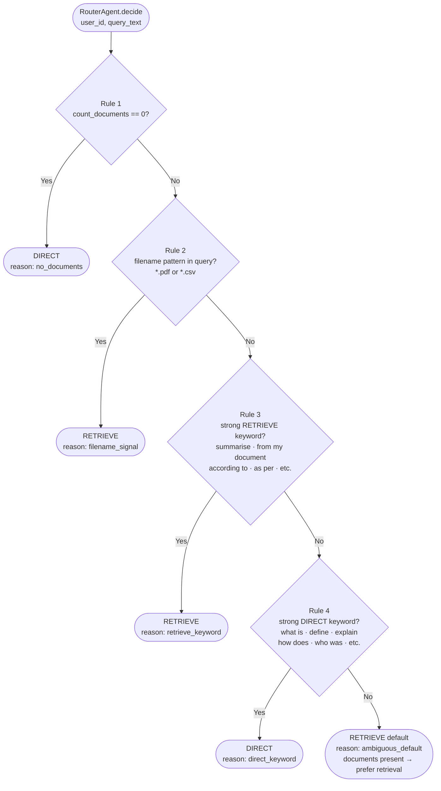

**Design rationale (from ADR-003):** When the signal is ambiguous and documents
are present, the agent defaults to RETRIEVE. A false RETRIEVE costs ~1 second of
extra latency. A false DIRECT may produce an answer that contradicts the user's
own documents. Correctness is worth more than marginal speed.

---

## 9. Technology Stack

### Core Framework

| Component | Library | Version | Purpose |
|-----------|---------|---------|---------|
| API framework | FastAPI | 0.111.0 | REST API, dependency injection, OpenAPI docs |
| ASGI server | Uvicorn (standard) | 0.29.0 | Production-grade async server |
| Data validation | Pydantic v2 | 2.7.1 | Request/response schema validation |
| Settings | pydantic-settings | 2.2.1 | Type-safe environment variable loading |
| HTTP client | httpx | 0.27.0 | Ollama API calls, test client |

### AI / ML

| Component | Library | Version | Purpose |
|-----------|---------|---------|---------|
| Embeddings | sentence-transformers | 3.0.1 | all-MiniLM-L6-v2 — 384-dim vectors, CPU-capable |
| Text splitting | langchain-text-splitters | 0.2.2 | RecursiveCharacterTextSplitter |
| LLM (cloud) | openai | 1.30.0 | gpt-4o and compatible models |
| LLM (local) | Ollama (HTTP) | any | mistral, llama3, codellama via local server |
| Vector database | ChromaDB | 0.5.3 | Persistent cosine-distance similarity search |

### Infrastructure

| Component | Library / Image | Version | Purpose |
|-----------|----------------|---------|---------|
| Cache | redis | 5.0.4 (client) | Query result caching, cache invalidation |
| Redis server | redis (Docker) | 7-alpine | LRU eviction, AOF persistence |
| File upload | python-multipart | 0.0.9 | multipart/form-data parsing |
| Env loading | python-dotenv | 1.0.1 | .env file support in development |

### Document Parsing

| Component | Library | Version | Purpose |
|-----------|---------|---------|---------|
| PDF parsing | pdfplumber | 0.11.0 | Text extraction from PDF files |
| CSV parsing | pandas | 2.2.2 | Structured data → text conversion |

---

## 10. Project Structure

```
ai-platform/
│
├── app/                          # All application source code
│   ├── agents/                   # AI routing agent
│   │   └── router_agent.py       # RouterAgent: 5-rule DIRECT vs RETRIEVE decision
│   │
│   ├── api/routes/               # FastAPI route handlers (API layer only, no logic)
│   │   ├── health.py             # GET /health
│   │   ├── query.py              # POST /query
│   │   ├── upload.py             # POST /upload-doc
│   │   ├── user.py               # POST /user
│   │   └── logs.py               # GET /logs
│   │
│   ├── cache/                    # Redis integration
│   │   ├── cache_service.py      # CacheService: get/set/invalidate with TTL
│   │   └── redis_client.py       # Redis connection pool singleton
│   │
│   ├── config/                   # Configuration and dependency injection
│   │   ├── settings.py           # All env vars with type validation (pydantic-settings)
│   │   └── dependencies.py       # FastAPI Depends() providers for all services
│   │
│   ├── logging/                  # Structured logging framework
│   │   ├── logger.py             # get_logger() — JSON formatter, request context
│   │   ├── formatters.py         # JSON log formatter
│   │   ├── context.py            # Request-scoped context (request_id, user_id)
│   │   └── timing.py             # LatencyTracker for pipeline stage timing
│   │
│   ├── middleware/               # ASGI middleware (executed before route handlers)
│   │   ├── tenant_context.py     # Validates X-User-Id header, sets request.state
│   │   ├── request_logger.py     # Per-request structured log entry
│   │   └── error_handler.py      # Maps domain exceptions to HTTP status codes
│   │
│   ├── models/                   # Domain dataclasses (no HTTP/validation concerns)
│   │   ├── chunk.py              # Chunk, ChunkResult
│   │   ├── document.py           # Document metadata
│   │   ├── exceptions.py         # Full domain exception hierarchy
│   │   └── query_result.py       # QueryResult, TokenUsage, SourceReference
│   │
│   ├── rag/                      # RAG pipeline components
│   │   ├── context_assembler.py  # Filter → sort → budget → format chunks
│   │   ├── prompt_builder.py     # System prompt + user message construction
│   │   ├── token_utils.py        # Token estimation (character approximation)
│   │   └── parsers/
│   │       ├── pdf_parser.py     # pdfplumber-based PDF text extraction
│   │       └── csv_parser.py     # pandas-based CSV → text conversion
│   │
│   ├── repositories/             # Data access layer (only file touching ChromaDB)
│   │   └── chroma_repository.py  # add_chunks, search_chunks, delete, count
│   │
│   ├── schemas/                  # Pydantic HTTP request/response models
│   │   ├── query_request.py      # QueryRequest (query, top_k)
│   │   ├── query_response.py     # QueryResponse (answer, sources, route, ...)
│   │   ├── upload_request.py     # UploadRequest
│   │   └── upload_response.py    # UploadResponse (doc_id, chunks_stored, ...)
│   │
│   ├── services/                 # Business logic orchestration
│   │   ├── query_service.py      # QueryService: full RAG pipeline
│   │   ├── routed_query_service.py # RoutedQueryService: routing + dispatch
│   │   ├── cached_query_service.py # CachedQueryService: Redis wrapper
│   │   ├── document_service.py   # DocumentService: parse → chunk → embed → store
│   │   ├── embedding_service.py  # EmbeddingService: model singleton + encode
│   │   ├── llm_service.py        # LLMProvider ABC + Local/OpenAI/Ollama impls
│   │   └── chunking_service.py   # ChunkingService: LangChain text splitting
│   │
│   └── vectorstore/              # ChromaDB client management
│       ├── client.py             # HttpClient singleton, startup/shutdown
│       └── tenant.py             # Metadata field constants, chunk ID builder
│
├── docs/
│   ├── adr/                      # Architecture Decision Records
│   ├── api/                      # API reference documentation
│   └── architecture/             # Architecture overview
│
├── scripts/
│   ├── backup.sh                 # Backup ChromaDB + Redis volumes
│   ├── healthcheck.sh            # Docker HEALTHCHECK script
│   └── reingest.sh               # Re-embed all documents after model change
│
├── tests/
│   ├── api/                      # Route handler tests (with mocked services)
│   ├── fixtures/                 # Binary test fixtures (sample.pdf, sample.csv)
│   ├── integration/              # ChromaDB integration tests (require live DB)
│   ├── unit/                     # Unit tests (no external services)
│   └── conftest.py               # Shared fixtures and test configuration
│
├── .env.example                  # All environment variables with documentation
├── .github/workflows/ci.yml      # CI pipeline (lint + test)
├── docker-compose.yml            # Three-service stack: app + chromadb + redis
├── Dockerfile                    # Two-stage production image
├── main.py                       # FastAPI app factory + lifespan hooks
├── pyproject.toml                # ruff linting, mypy, pytest configuration
├── requirements.txt              # Pinned production dependencies
└── requirements-dev.txt          # Dev and test dependencies
```

---

## 11. Installation — Local Setup

**Prerequisites:** Python 3.11+, a running ChromaDB instance, a running Redis instance.

```bash
# 1. Clone the repository
git clone https://github.com/yourusername/ai-platform.git
cd ai-platform

# 2. Create and activate a virtual environment
python -m venv .venv
source .venv/bin/activate          # macOS / Linux
# .venv\Scripts\activate           # Windows

# 3. Install production dependencies
pip install -r requirements.txt

# 4. Install development/test dependencies
pip install -r requirements-dev.txt

# 5. Create your environment file
cp .env.example .env
# Open .env and set at minimum:
#   LLM_API_KEY=sk-...       (for OpenAI)
#   LLM_PROVIDER=openai      (or ollama for local)

# 6. Start ChromaDB (separate terminal)
chroma run --host localhost --port 8001

# 7. Start Redis (separate terminal)
redis-server

# 8. Start the API server
uvicorn main:app --host 0.0.0.0 --port 8000 --reload

# 9. Verify
curl http://localhost:8000/health
# Expected: {"status": "ok", "env": "development", "version": "0.1.0"}
```

---

## 12. Docker Setup

Docker Compose starts all three services in the correct order with health checks.
This is the recommended approach — no manual ChromaDB or Redis setup required.

**Prerequisites:** Docker Desktop or Docker Engine with the Compose plugin.

```bash
# 1. Clone the repository
git clone https://github.com/yourusername/ai-platform.git
cd ai-platform

# 2. Create your environment file
cp .env.example .env
# Set LLM_API_KEY in .env (or keep LLM_PROVIDER=local for development)

# 3. Start all services
docker compose up

# The first run downloads images and builds the app image (~2-3 minutes).
# Watch for: "platform starting" and "chromadb ready" in the logs.

# 4. Verify
curl http://localhost:8000/health
```

### Useful Docker commands

```bash
# Start in background
docker compose up -d

# Follow application logs only
docker compose logs -f app

# Rebuild after code changes
docker compose build app && docker compose up app

# Start only infrastructure (use local Python for the app)
docker compose up chromadb redis -d

# Stop all services (data persists in named volumes)
docker compose down

# Stop and DELETE all data
docker compose down -v
```

### Port mapping

| Service | Host port | Container port | Use |
|---------|-----------|---------------|-----|
| FastAPI app | 8000 | 8000 | All API calls |
| ChromaDB | 8001 | 8000 | Direct vector DB inspection |
| Redis | 6379 | 6379 | Direct cache inspection (`redis-cli`) |

---

## 13. Environment Variables

All variables are read from `.env` (development) or injected as environment variables
(Docker / production). The `docker-compose.yml` overrides `CHROMA_HOST`, `REDIS_HOST`,
and `OLLAMA_BASE_URL` with Docker service names automatically.

| Variable | Default | Required | Description |
|----------|---------|----------|-------------|
| `LLM_API_KEY` | `changeme` | **Yes (prod)** | OpenAI API key (`sk-...`). App starts with `changeme` but production startup validation rejects it. |
| `LLM_PROVIDER` | `local` | No | `openai` · `ollama` · `local` |
| `LLM_MODEL_NAME` | `gpt-4o` | No | Model identifier. OpenAI: `gpt-4o`, `gpt-4o-mini`. Ollama: `mistral`, `llama3`, etc. |
| `OLLAMA_BASE_URL` | `http://localhost:11434` | No | Ollama server URL. Docker: `http://host.docker.internal:11434` |
| `LLM_TIMEOUT_SECONDS` | `30` | No | Max seconds to wait for LLM response |
| `APP_ENV` | `development` | No | `development` (Swagger UI enabled) · `production` (Swagger disabled) |
| `LOG_LEVEL` | `INFO` | No | `DEBUG` · `INFO` · `WARNING` · `ERROR` |
| `CHROMA_HOST` | `localhost` | No | ChromaDB hostname. Docker Compose overrides to `chromadb`. |
| `CHROMA_PORT` | `8000` | No | ChromaDB internal port (not the host-mapped 8001) |
| `CHROMA_COLLECTION_NAME` | `documents` | No | Single shared collection for all tenants |
| `REDIS_HOST` | `localhost` | No | Redis hostname. Docker Compose overrides to `redis`. |
| `REDIS_PORT` | `6379` | No | Redis port |
| `REDIS_CACHE_TTL_SECONDS` | `1800` | No | Cache TTL for successful query results (30 min) |
| `REDIS_EMPTY_RESULT_TTL_SECONDS` | `300` | No | Cache TTL for no-result responses (5 min) |
| `EMBEDDING_MODEL_NAME` | `all-MiniLM-L6-v2` | No | sentence-transformers model. ⚠️ Changing after ingestion requires re-embedding. |
| `EMBEDDING_BATCH_SIZE` | `100` | No | Chunks per `model.encode()` call |
| `CHUNK_SIZE_TOKENS` | `512` | No | Max tokens per chunk |
| `CHUNK_OVERLAP_TOKENS` | `50` | No | Token overlap between adjacent chunks |
| `RETRIEVAL_TOP_K` | `5` | No | Candidate chunks to retrieve per query (range: 1–20) |
| `RETRIEVAL_CONFIDENCE_THRESHOLD` | `0.25` | No | Minimum cosine similarity to include a chunk (0.0–1.0) |
| `MAX_UPLOAD_SIZE_MB` | `50` | No | Maximum file size enforced before reading bytes |
| `UPLOAD_TIMEOUT_SECONDS` | `120` | No | Max seconds for the synchronous upload pipeline |

---

## 14. API Endpoints

All endpoints except `/health` and `POST /user` require the `X-User-Id: <user_id>`
header.

### `GET /health`

Health check. No authentication required.

```bash
curl http://localhost:8000/health
```

```json
{
  "status": "ok",
  "env": "development",
  "version": "0.1.0"
}
```

---

### `POST /user`

Register a user identity. Must be called before uploading documents or querying.

```bash
curl -X POST http://localhost:8000/user \
     -H "Content-Type: application/json" \
     -d '{"user_id": "alice"}'
```

**Request body:**

```json
{"user_id": "alice"}
```

`user_id` constraints: 1–64 characters, alphanumeric, hyphens, and underscores only.

**Response 201:**

```json
{
  "user_id": "alice",
  "created_at": "2024-06-01T12:00:00Z",
  "message": "User 'alice' registered successfully."
}
```

**Error responses:** `409` if user already exists.

---

### `POST /upload-doc`

Upload and ingest a PDF or CSV document. The request is synchronous — the response
is returned only after all chunks are stored in ChromaDB.

```bash
curl -X POST http://localhost:8000/upload-doc \
     -H "X-User-Id: alice" \
     -F "file=@/path/to/document.pdf" \
     -F "file_type=pdf"
```

**Form fields:**
- `file` — the document (PDF or CSV)
- `file_type` — `"pdf"` or `"csv"`

**Response 201:**

```json
{
  "document_id": "doc_a1b2c3d4",
  "user_id": "alice",
  "filename": "document.pdf",
  "file_type": "pdf",
  "chunks_stored": 42,
  "status": "complete",
  "upload_timestamp": "2024-06-01T12:00:00Z"
}
```

**Error responses:**

| Code | Error | Cause |
|------|-------|-------|
| 400 | `INVALID_FILE_TYPE` | File is not PDF or CSV |
| 400 | `CORRUPT_FILE` | PDF cannot be parsed |
| 400 | `EMPTY_DOCUMENT` | File produces no extractable text |
| 413 | `FILE_TOO_LARGE` | Exceeds `MAX_UPLOAD_SIZE_MB` |
| 503 | `VECTOR_STORE_UNAVAILABLE` | ChromaDB unreachable |

---

### `POST /query`

Submit a natural language query. The router agent decides whether to retrieve
from the user's documents or answer from general LLM knowledge.

```bash
curl -X POST http://localhost:8000/query \
     -H "Content-Type: application/json" \
     -H "X-User-Id: alice" \
     -d '{"query": "What are the main findings in this document?", "top_k": 5}'
```

**Request body:**

```json
{
  "query": "What are the main findings in this document?",
  "top_k": 5
}
```

`top_k` is optional (default: `RETRIEVAL_TOP_K`). Range: 1–20.

**Response 200 — answer found:**

```json
{
  "query": "What are the main findings in this document?",
  "answer": "The document identifies three main findings: ... [Source: report.pdf, chunk 4]",
  "sources": [
    {
      "doc_id": "doc_a1b2c3d4",
      "source": "report.pdf",
      "chunk_count": 3,
      "top_score": 0.88
    }
  ],
  "route": "RETRIEVE",
  "chunks_retrieved": 5,
  "chunks_used": 3,
  "token_usage": {
    "prompt_tokens": 1240,
    "completion_tokens": 128,
    "total_tokens": 1368
  },
  "latency_ms": 1450,
  "no_result_reason": null,
  "cache_hit": false,
  "timestamp": "2024-06-01T12:00:00Z"
}
```

**Response 200 — no relevant content found:**

```json
{
  "query": "What is the capital of France?",
  "answer": null,
  "sources": [],
  "route": "RETRIEVE",
  "no_result_reason": "No chunks met the confidence threshold of 0.25. The uploaded documents do not appear to contain information relevant to this query.",
  "cache_hit": false
}
```

**Response 200 — general knowledge (DIRECT route):**

```json
{
  "query": "What is machine learning?",
  "answer": "Machine learning is a branch of artificial intelligence...",
  "sources": [],
  "route": "DIRECT",
  "chunks_retrieved": 0,
  "chunks_used": 0,
  "cache_hit": false
}
```

**Error responses:**

| Code | Error | Cause |
|------|-------|-------|
| 401 | `UNAUTHORIZED` | Missing or invalid `X-User-Id` header |
| 422 | Validation error | Invalid request body |
| 502 | `LLM_PROVIDER_ERROR` | LLM API returned an error |
| 503 | `VECTOR_STORE_UNAVAILABLE` | ChromaDB unreachable |
| 504 | `LLM_TIMEOUT` | LLM did not respond within `LLM_TIMEOUT_SECONDS` |

---

### `GET /logs`

Retrieve operational metrics for the authenticated user.

```bash
curl http://localhost:8000/logs \
     -H "X-User-Id: alice"
```

**Response 200:**

```json
{
  "user_id": "alice",
  "note": "Metrics persistence not yet implemented. Values are placeholders.",
  "request_metrics": {"total_requests": 0, "avg_latency_ms": 0},
  "cache_statistics": {"hit_rate_pct": 0.0, "cache_hits": 0, "cache_misses": 0},
  "route_decisions": {"direct_count": 0, "retrieve_count": 0},
  "documents": {"total_uploaded": 0, "total_chunks_stored": 0}
}
```

> **Note:** This endpoint is scaffolded. The route handler and response schema
> are complete, but metrics are not yet persisted between requests.
> All values currently return as zeros.

---

## 15. Example Use Cases

The platform is domain-agnostic — it works with any PDF or CSV document. The
following examples illustrate different query patterns, not the platform's identity.

---

### Use Case 1: Research Paper Q&A

A researcher uploads academic papers and queries them for specific information
without reading every page.

```bash
# Upload a paper
curl -X POST http://localhost:8000/upload-doc \
     -H "X-User-Id: researcher-1" \
     -F "file=@attention_is_all_you_need.pdf" \
     -F "file_type=pdf"

# Query for specific findings
curl -X POST http://localhost:8000/query \
     -H "Content-Type: application/json" \
     -H "X-User-Id: researcher-1" \
     -d '{"query": "What attention mechanism does the Transformer use and how many heads?"}'
```

**Expected behaviour:** The system retrieves the relevant section on multi-head
attention, assembles it as context, and the LLM answers citing the specific
chunk from the paper.

---

### Use Case 2: CSV / Tabular Data Querying

A data analyst uploads a sales CSV and asks questions without writing SQL or Python.

```bash
# Upload CSV
curl -X POST http://localhost:8000/upload-doc \
     -H "X-User-Id: analyst-bob" \
     -F "file=@q3_sales.csv" \
     -F "file_type=csv"

# Query for summary statistics
curl -X POST http://localhost:8000/query \
     -H "Content-Type: application/json" \
     -H "X-User-Id: analyst-bob" \
     -d '{"query": "Which product category had the highest revenue in Q3?"}'
```

**Expected behaviour:** CSV rows are converted to text, embedded, and retrieved
by semantic similarity. The LLM reads the relevant rows and synthesises an answer.

---

### Use Case 3: Resume / CV Analysis

An HR professional uploads candidate CVs and asks natural language questions about
qualifications, skills, or experience.

```bash
# Upload a resume
curl -X POST http://localhost:8000/upload-doc \
     -H "X-User-Id: hr-team" \
     -F "file=@candidate_resume.pdf" \
     -F "file_type=pdf"

# Query for specific information
curl -X POST http://localhost:8000/query \
     -H "Content-Type: application/json" \
     -H "X-User-Id: hr-team" \
     -d '{"query": "What programming languages does this candidate know?"}'
```

**Expected behaviour:** The relevant sections of the resume (skills, projects)
are retrieved and the LLM summarises the candidate's technical skills with
source citations.

---

### Use Case 4: General Knowledge (DIRECT Route)

When no documents are uploaded, or when the query clearly asks general knowledge,
the router bypasses retrieval.

```bash
# No documents uploaded for this user
curl -X POST http://localhost:8000/query \
     -H "Content-Type: application/json" \
     -H "X-User-Id: new-user" \
     -d '{"query": "What is the difference between supervised and unsupervised learning?"}'
```

**Expected behaviour:** `RouterAgent` detects either zero documents (Rule 1) or
a strong general-knowledge signal (Rule 4) and routes DIRECT. The LLM answers
from training knowledge with no ChromaDB lookup. `route: "DIRECT"` in response.

---

### Use Case 5: Cache Hit Behaviour

Repeated identical queries within the TTL window are served from Redis.

```bash
# First query — cache miss, ~1.5s
curl -X POST http://localhost:8000/query \
     -H "X-User-Id: alice" \
     -d '{"query": "Summarise the uploaded report"}'
# Response: {"cache_hit": false, "latency_ms": 1420}

# Second identical query — cache hit, ~5ms
curl -X POST http://localhost:8000/query \
     -H "X-User-Id: alice" \
     -d '{"query": "Summarise the uploaded report"}'
# Response: {"cache_hit": true, "latency_ms": 8}
```

---

## 16. Testing and Validation

### Test Structure

The test suite is organised into three independent layers:

```
tests/
├── unit/          # No external services — pure Python, mocked dependencies
├── integration/   # Requires live ChromaDB (can use Docker service)
├── api/           # FastAPI TestClient tests with mocked service layer
└── conftest.py    # Shared fixtures
```

### Running Tests

```bash
# Full test suite
python -m pytest -v

# Unit tests only (no infrastructure required)
python -m pytest tests/unit/ -v

# Integration and API tests (requires running ChromaDB + Redis)
python -m pytest tests/integration/ tests/api/ -v

# With coverage report
python -m pytest --cov=app --cov-report=term-missing
```

### What the Tests Cover

| Area | What is tested |
|------|---------------|
| **Settings validation** | All 9 startup rules — chunk overlap, threshold range, production key check |
| **RouterAgent** | All 5 routing rules across 20+ query patterns |
| **Context assembly** | Threshold filtering, score sorting, character budget, deduplication |
| **Prompt builder** | Message structure, CONTEXT tag presence, direct prompt format |
| **ChromaRepository** | add/search/delete/count — tenant isolation, error wrapping |
| **EmbeddingService** | Model loading, batch encoding, singleton behaviour |
| **LLM providers** | LocalProvider, OllamaProvider (mocked HTTP), error handling |
| **CacheService** | Cache hit/miss, TTL variants, invalidation |
| **Middleware** | TenantContext header validation, error handler HTTP mapping |
| **API routes** | All endpoints — success, validation errors, service errors |
| **Integration** | End-to-end ChromaDB: add → search → delete → count |

### Validated Behaviours

The following have been verified through testing:

- **Tenant isolation:** User A's chunks are never returned in User B's queries —
  the `where` filter is enforced at the repository level and tested in isolation.
- **No hallucination guard:** The LLM is not called when no chunks meet the
  confidence threshold. `answer` is `null`, not a hallucinated response.
- **Cache invalidation:** Uploading a new document clears that user's cache
  entries without affecting other users.
- **Summary query boost:** Queries containing summary keywords (`summarise`,
  `overview`, `full profile`, etc.) automatically retrieve more chunks (`top_k`
  ≥ 7) to produce comprehensive answers.
- **Error propagation:** ChromaDB unavailability returns 503, LLM timeout returns
  504, and validation errors return 422 — each with a structured JSON error body.

---

## 17. Screenshots

### System Architecture

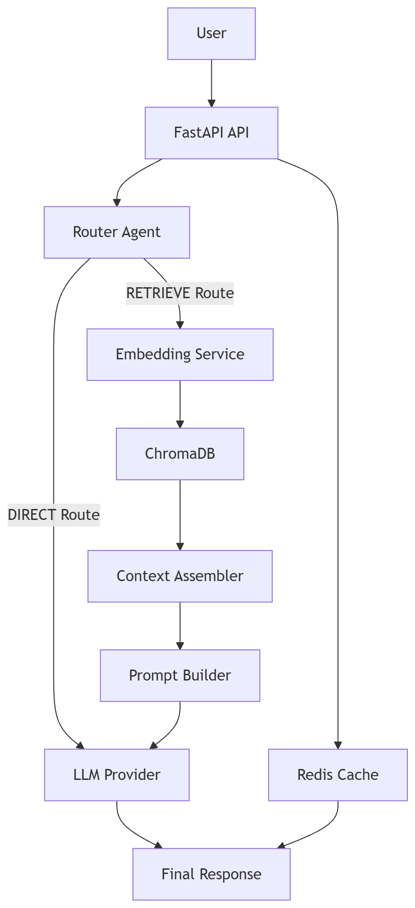

---

### Swagger API Documentation

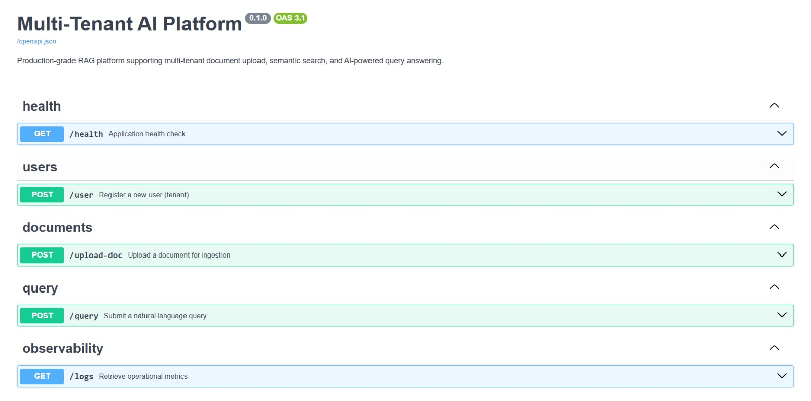

---

### Document Upload

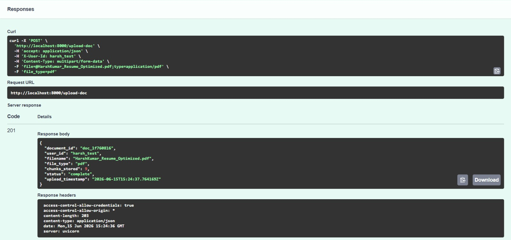

---

### Retrieval Query Example

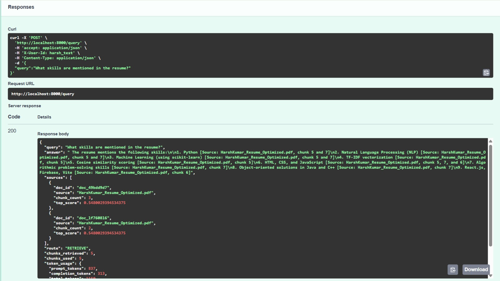

---

### Complete Profile Generation

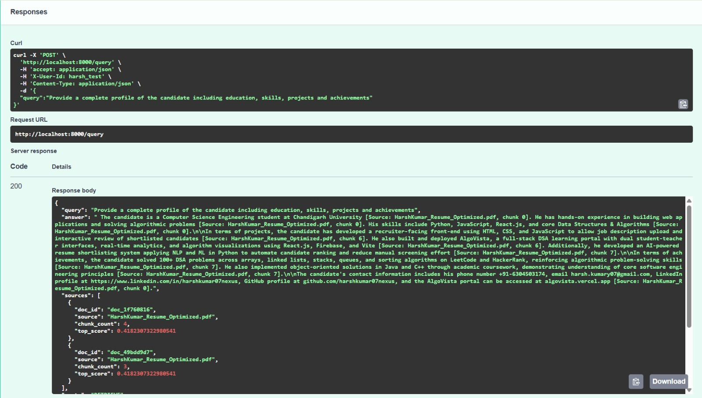

---

### Docker Deployment

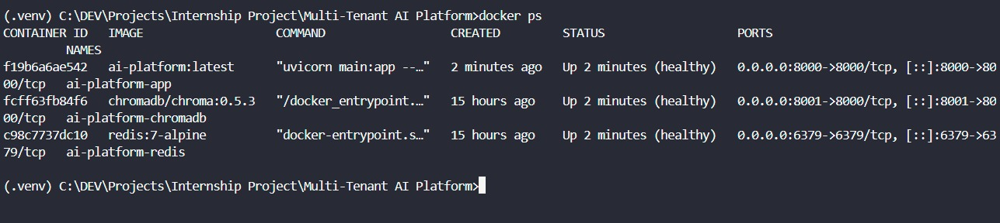


---

## 18. Results Achieved

The following table maps each assignment requirement to the implementation:

| Assignment Requirement | Implementation | Status |
|----------------------|----------------|--------|
| **Multi-user system with data isolation** | Six-layer isolation: header validation, DI injection, ChromaDB `where` filter, write-time metadata, cache key namespacing, scoped invalidation | ✅ Complete |
| **Document upload (PDF)** | pdfplumber-based parser, page-by-page extraction | ✅ Complete |
| **Document upload (CSV)** | pandas-based parser, rows converted to text | ✅ Complete |
| **Chunking** | LangChain RecursiveCharacterTextSplitter, 512 tokens, 50 overlap | ✅ Complete |
| **Embeddings** | sentence-transformers all-MiniLM-L6-v2, 384-dimensional, CPU-capable | ✅ Complete |
| **Vector storage** | ChromaDB 0.5.3, cosine distance, persistent named volume | ✅ Complete |
| **Smart query engine — retrieval** | embed → search → filter → assemble → LLM | ✅ Complete |
| **Smart query engine — LLM response** | Configurable provider, anti-hallucination system prompt | ✅ Complete |
| **AI Agent (DIRECT vs RETRIEVE)** | RouterAgent with 5 deterministic rules, <20ms overhead | ✅ Complete |
| **POST /upload-doc** | Multipart form, sync pipeline, structured response | ✅ Complete |
| **POST /query** | Full RAG + routing + caching, structured response | ✅ Complete |
| **POST /user** | User registration with conflict detection | ✅ Complete |
| **GET /logs** | Endpoint scaffolded, schema defined | ⚠️ Stub (no persistence) |
| **Caching (Redis)** | Per-user TTL cache, automatic invalidation on upload | ✅ Complete |
| **Performance optimisation** | Cache-first query path, singleton model, batch embeddings, routing to skip retrieval | ✅ Complete |
| **Logging** | Structured JSON logging, request_id, user_id, latency on every entry | ✅ Complete |
| **Monitoring** | Token usage tracked per response, pipeline stage latency in logs | ✅ Complete |
| **Error handling** | Domain exception hierarchy, HTTP mapping middleware, structured error bodies | ✅ Complete |
| **Dockerized deployment** | docker-compose.yml, three services, health checks, named volumes | ✅ Complete |
| **Bonus: Multi-LLM support** | OpenAI (gpt-4o), Ollama (any local model), LocalProvider (dev/CI) | ✅ Complete |
| **Bonus: Cost tracking** | `token_usage` (prompt + completion + total) on every query response | ✅ Complete |
| **Bonus: Async processing** | Not implemented — upload pipeline is synchronous | ❌ Not implemented |

---

## 19. Limitations

These limitations are present in the current implementation and should be
understood before using the platform in a real production context:

1. **Synchronous document upload.** The ingestion pipeline (parse → chunk → embed
   → store) runs synchronously within the HTTP request. Large files near the
   50MB limit can take 60–90 seconds. There is no background task queue.

2. **GET /logs returns placeholder zeros.** The endpoint and schema are implemented,
   but no metrics are persisted between requests. It always returns zeros.

3. **Approximate token counting.** The context assembly budget uses the heuristic
   `1 token ≈ 4 characters`. The `tiktoken` library (exact BPE counting for
   OpenAI models) is not installed. The approximation is conservative — it will
   never exceed the real limit, but may under-use the budget by ~10–20%.

4. **Single vector collection for all tenants.** All users' embeddings share one
   ChromaDB collection. Tenant isolation is enforced by metadata filtering, not
   physical separation. At very large scale (millions of vectors), per-tenant
   collections would be more performant.

5. **Anthropic provider not fully wired.** The `AnthropicProvider` class is
   implemented, but the `anthropic` package is not in `requirements.txt`. Adding
   it requires uncommenting the package and adding `LLM_PROVIDER=anthropic`
   support to the factory.

6. **No authentication.** The `X-User-Id` header is a simple string identifier,
   not a signed token. In production, this should be replaced with JWT-based
   auth.

7. **No document deletion endpoint.** Once a document is uploaded, it can only
   be deleted programmatically via the admin API or by clearing the collection.

8. **RouterAgent uses string matching only.** The DIRECT/RETRIEVE decision is
   deterministic but can misroute edge cases (e.g., a question about content in
   a document that also happens to start with "what is").

---

## 20. Future Enhancements

These improvements are identified as the natural next steps for the platform:

| Priority | Enhancement | Rationale |
|----------|------------|-----------|
| High | **Async ingestion with background tasks** | Decouple upload response from processing time; use FastAPI `BackgroundTasks` or Celery |
| High | **Metrics persistence (GET /logs)** | Store per-user request counts, latency, token usage in Redis or a lightweight DB |
| High | **JWT-based authentication** | Replace `X-User-Id` header with signed tokens for real security |
| Medium | **Exact token counting (tiktoken)** | Replace character approximation with BPE token counting for OpenAI models |
| Medium | **DELETE /upload-doc/{document_id}** | Allow users to remove documents and trigger cache invalidation |
| Medium | **Document re-embedding script** | `scripts/reingest.sh` — already scaffolded, needs implementation |
| Medium | **Streaming LLM responses** | Stream tokens to the client for better perceived latency on long answers |
| Low | **Per-tenant ChromaDB collections** | Scale isolation for high-volume deployments |
| Low | **Anthropic provider** | Uncomment package, add to `requirements.txt`, test |
| Low | **Tiktoken integration** | More accurate context window budgeting |
| Low | **Document management UI** | Simple web interface for upload/query/delete |

---

## 21. Author

**Harsh Kumar**  
Computer Science Engineering Student

Email: harsh.kumary07@gmail.com

LinkedIn: https://www.linkedin.com/in/harshkumar07nexus/

GitHub: https://github.com/harshkumary07-cmd

---

*This project was built as the capstone assignment for an Advanced AI/ML Engineering
internship programme. The assignment required demonstrating practical mastery of
RAG pipelines, multi-tenant system design, AI agent architecture, and production
deployment practices.*

---

<details>
<summary><strong>Quick Reference — Common Commands</strong></summary>

```bash
# Start platform
docker compose up

# Register user
curl -X POST http://localhost:8000/user \
     -H "Content-Type: application/json" \
     -d '{"user_id": "myuser"}'

# Upload PDF
curl -X POST http://localhost:8000/upload-doc \
     -H "X-User-Id: myuser" \
     -F "file=@document.pdf" \
     -F "file_type=pdf"

# Upload CSV
curl -X POST http://localhost:8000/upload-doc \
     -H "X-User-Id: myuser" \
     -F "file=@data.csv" \
     -F "file_type=csv"

# Query
curl -X POST http://localhost:8000/query \
     -H "Content-Type: application/json" \
     -H "X-User-Id: myuser" \
     -d '{"query": "What does this document say about X?"}'

# Health check
curl http://localhost:8000/health

# View API docs (development only)
open http://localhost:8000/docs
```

</details>
